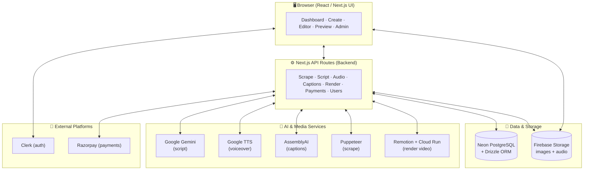
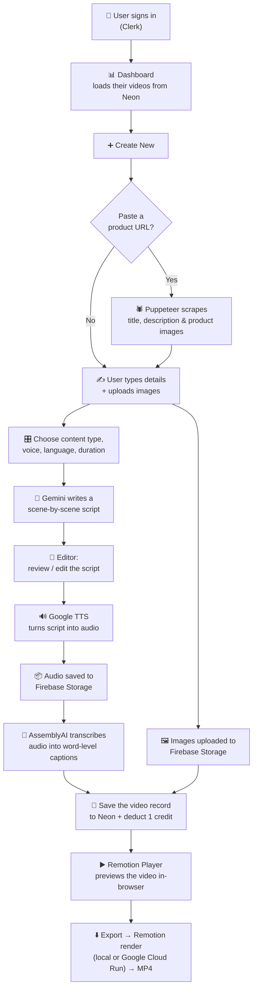
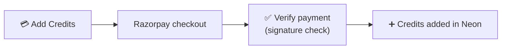

# AI Short Video Generator — Architecture & Flow

A simple guide to how this project is built, how data flows through it, and which
service does what (and why). No code — just the big picture.

---

## 1. What the app does (in one line)

You give it a product (a URL or a few images + details), and it writes a script,
speaks it out loud, adds synced captions, and stitches everything into a
vertical short video you can preview and download.

---

## 2. The tech stack at a glance

| Layer | Technology |
| --- | --- |
| **Framework** | Next.js 15 (App Router) — one codebase for the UI **and** the backend API routes |
| **UI** | React 18, Tailwind CSS, shadcn/ui (Radix primitives), Framer Motion, Lucide icons |
| **Auth** | Clerk |
| **Database** | Neon (serverless PostgreSQL) via Drizzle ORM |
| **Script AI** | Google Gemini (`gemini-flash-latest`) |
| **Voiceover** | Google Cloud Text-to-Speech |
| **Captions** | AssemblyAI (speech-to-text with word timings) |
| **File storage** | Firebase Storage |
| **Web scraping** | Puppeteer (headless Chrome) |
| **Video engine** | Remotion (Player for preview, Renderer for export) |
| **Cloud rendering** | Google Cloud Run (via Remotion Cloud Run) |
| **Payments** | Razorpay |

---

## 3. The big picture (layered architecture)

**How to read it:** the browser talks to Next.js API routes; those routes
coordinate the database, file storage, and the AI/media services. Clerk guards
who gets in, and Razorpay handles money.

---

## 4. The main pipeline — creating a video, step by step

### In plain words
1. **Sign in** with Clerk.
2. The **dashboard** shows the videos you already made (read from Neon).
3. In **Create New**, you can paste a product link — **Puppeteer** visits the
   page and pulls the title, description, and real product images. Or you just
   type the details and upload images yourself.
4. You pick the **style, voice, language, and length**.
5. **Gemini** writes the script, one short scene per image.
6. In the **editor**, you review the script and hit *Create*.
7. **Google TTS** speaks the script into an audio file, which is stored in
   **Firebase Storage**.
8. **AssemblyAI** listens to that audio and returns each word with exact timings,
   which become the on-screen **captions**.
9. Your **images** (uploaded + scraped) are stored in **Firebase Storage**.
10. The finished video's data is saved to **Neon**, and **1 credit** is deducted.
11. **Remotion** shows a live **preview** in the browser (images with a smooth
    Ken-Burns zoom + crossfades, synced captions, and the voiceover).
12. **Export** renders a real **MP4** — locally, or on **Google Cloud Run** for
    heavier jobs.

### The side flow — buying credits

---

## 5. Each service — what it does & why we use it

### 🧩 Next.js 15 (App Router)
- **What:** the whole application framework — renders the React UI **and** hosts
  the backend API routes in one project.
- **Why:** one codebase for frontend + backend, fast routing, built-in API
  endpoints, and easy deployment. No separate server to maintain.

### 🎨 Tailwind CSS + shadcn/ui + Framer Motion
- **What:** the design system. Tailwind for styling, shadcn/ui (built on Radix)
  for accessible components (dialogs, selects, tooltips), Framer Motion for
  animation.
- **Why:** build a consistent, polished, responsive, light/dark UI quickly
  without hand-writing low-level component behaviour.

### 🔐 Clerk (authentication)
- **What:** handles sign-up, sign-in, sessions, and user profiles. Also stores a
  user "role" (e.g. admin) used to guard the admin area.
- **Why:** secure, drop-in auth so we never store passwords ourselves; protects
  the dashboard, admin, and API routes.

### 💾 Neon (PostgreSQL) + Drizzle ORM
- **What:** the database. Neon is serverless Postgres; Drizzle is the type-safe
  layer we use to read/write it. Stores users, credits, video records, and
  orders.
- **Why:** Neon scales to zero (cheap, no server to run) and connects over HTTP,
  which fits serverless API routes. Drizzle keeps queries safe and readable.

### 🕷️ Puppeteer (product scraping)
- **What:** a headless Chrome browser that visits a product URL and extracts the
  title, description, product images, and any product video.
- **Why:** lets users start from a real product link instead of typing
  everything. It reads **structured data** (Open Graph / JSON-LD) first for the
  true product images and deliberately **skips reviews, ads, logos, and
  "related" items** so only genuine product imagery is pulled.

### 🤖 Google Gemini (script writing)
- **What:** the language model (`gemini-flash-latest`) that turns the product
  details into a short, scene-by-scene narration script in the chosen language.
- **Why:** fast, low-cost, high-quality multilingual text generation — the
  creative brain that writes what the video will say.

### 🔊 Google Cloud Text-to-Speech (voiceover)
- **What:** converts the script text into natural-sounding spoken audio, in the
  selected language and voice gender.
- **Why:** gives every video a professional voiceover automatically, with broad
  language support (including several Indian languages).

### 💬 AssemblyAI (captions)
- **What:** listens to the generated audio and returns a transcript with the
  **start/end time of every word**.
- **Why:** those precise word timings are what let the captions appear perfectly
  in sync with the voiceover on screen.

### 📦 Firebase Storage (file hosting)
- **What:** stores the generated audio files and the user's images, and serves
  them back as public URLs.
- **Why:** the video engine needs stable, public URLs for every asset; Firebase
  provides simple, reliable file hosting.

### 🎬 Remotion (video engine)
- **What:** builds the video from React — arranging images with zoom/crossfade
  effects, overlaying synced captions, and adding the audio track. The
  **Player** shows a live preview in the browser; the **Renderer** exports a real
  MP4.
- **Why:** it makes the on-screen preview and the exported file use the **exact
  same** definition, so what you see is what you get.

### ☁️ Google Cloud Run (cloud rendering)
- **What:** runs the Remotion render in the cloud on demand (via Remotion Cloud
  Run) instead of on the local machine.
- **Why:** video rendering is heavy; Cloud Run provides scalable, on-demand
  compute so exports don't depend on the user's device.

### 💳 Razorpay (payments)
- **What:** processes payments when a user buys more credits, and the payment is
  verified before credits are granted.
- **Why:** the app runs on a credit system (1 credit per video); Razorpay is a
  trusted gateway with strong support for Indian payments.

---

## 6. The credit system (how usage is metered)

- Every user has a **credit balance** stored in Neon.
- **Generating one video costs 1 credit.**
- When credits run low, the user buys more through **Razorpay**; after the
  payment is **verified**, the balance is topped up.
- Admins can view users, orders, and earnings in the **admin dashboard**.

---

## 7. Why this architecture works

- **One framework, many jobs** — Next.js hosts both the UI and the backend, so
  there's less to build and deploy.
- **Best tool per task** — a dedicated specialist for each hard problem:
  Gemini writes, Google TTS speaks, AssemblyAI listens, Remotion renders,
  Puppeteer scrapes.
- **Preview = export** — Remotion guarantees the browser preview matches the
  final MP4.
- **Pay-as-you-grow** — Neon and Cloud Run scale to zero when idle, keeping
  costs low, while Clerk and Razorpay remove the burden of building auth and
  payments from scratch.

---

## 8. Quick reference — request → service map

| User action | Backend route | Service(s) used |
| --- | --- | --- |
| Paste product URL | Scrape | Puppeteer (Chrome) |
| Generate script | Script | Google Gemini |
| Create voiceover | Audio | Google TTS → Firebase Storage |
| Add captions | Captions | AssemblyAI |
| Save / list / delete videos | Video data | Neon + Drizzle |
| Preview video | (in browser) | Remotion Player |
| Export MP4 | Render | Remotion + Google Cloud Run |
| Buy credits | Orders / Verify | Razorpay → Neon |
| Sign in / roles | (middleware) | Clerk |
