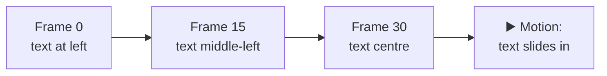
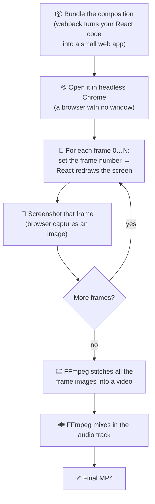
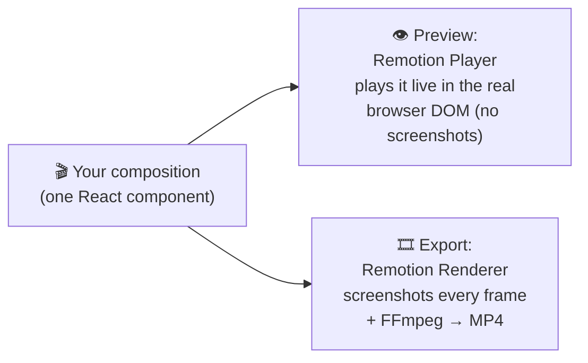
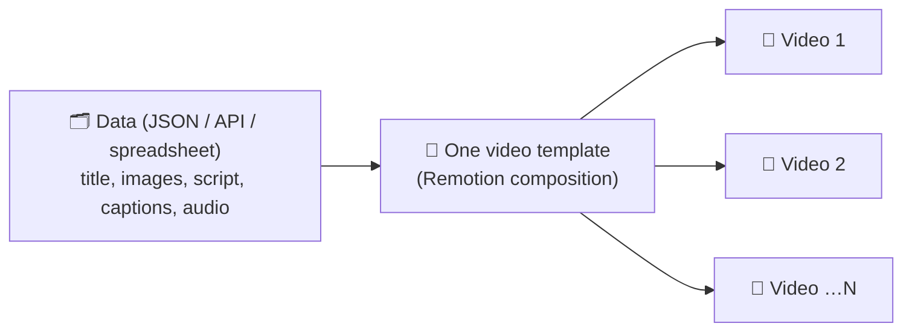
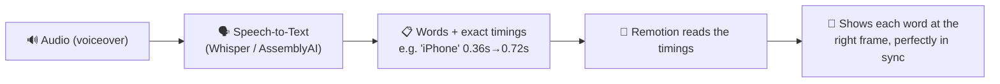
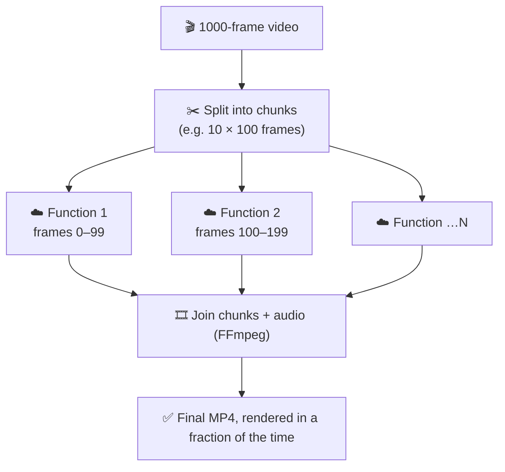

# Remotion — A Simple, Complete Guide

Everything about **Remotion**: what it is, why it exists, how it works under the
hood, and how it fits into an AI video pipeline. Written in plain language, with
diagrams. At the end there's a section that maps these ideas directly to the
**Video Automation Engineer** job description.

---

## 1. What is Remotion? (one line + an analogy)

> **Remotion lets you create real videos (MP4s) using React — the same way you
> build a website.**

**The analogy:** a normal video is like a **flipbook**. It's just a stack of
still pictures ("frames") shown quickly one after another — usually **30 frames
per second (fps)**. Your eyes blend them into motion.

Remotion's big idea: **let a React component draw each page of that flipbook.**
You describe *"what the screen looks like at a given moment,"* and Remotion draws
that moment for every frame, then binds the pages into a video.

---

## 2. The core mental model: **video = a function of time**

This is the single most important idea in Remotion:

> A frame is just **your design, calculated for one specific point in time.**

- The video knows the current **frame number** (0, 1, 2, 3 …).
- Your component asks *"which frame am I on right now?"* and draws accordingly.
- Frame 0 might show text at the left; frame 30 (one second later) shows it in
  the centre. Play them in order → the text slides across.

Because frame 30 **always** looks the same every time it's calculated, renders
are **deterministic** — reproducible and reliable. That predictability is what
makes automation possible.

---

## 3. Why use Remotion? (why not "just" a video editor?)

| The problem | Why Remotion solves it |
| --- | --- |
| You need **1,000 videos**, one per product | Write **one template**, feed it 1,000 rows of data → 1,000 videos. No manual editing. |
| Content comes from **data** (JSON, APIs, sheets) | The video is code, so it reads data directly and renders it. |
| You know **web tech** (React/CSS), not After Effects | Build videos with the skills you already have. |
| You want **preview = final output** | The browser preview and the exported MP4 use the *exact same* component. |
| You need this inside an **app/pipeline** | It's just JavaScript/Node — it plugs into any backend or cloud function. |

Traditional editors (Premiere, After Effects) are made for **hand-crafting one
video**. Remotion is made for **generating many videos automatically from data.**

---

## 4. The building blocks (the vocabulary)

You only need a handful of concepts:

- **Composition** — the "recipe" for a video. It declares the **width, height,
  frame rate (fps), and total length (duration in frames)**, and which component
  to render. One project can have many compositions.
- **`useCurrentFrame()`** — the hook that answers *"what frame am I on?"* Your
  component re-runs for every frame with a new value here.
- **`interpolate()`** — maps the frame number to a value. *"From frame 0→30, move
  opacity from 0→1"* creates a fade-in. It's the workhorse of animation.
- **`spring()`** — like interpolate but with natural, physics-based bounce/ease.
- **`<Sequence>`** — places an element on the timeline (start at frame X, last Y
  frames). Inside it, time is **relative**, so each clip animates from its own
  "frame 0."
- **Media tags (``, `<Audio>`, `<Video>`)** — put images, sound, and video
  clips into the composition; Remotion keeps them in sync with the timeline.
- **`AbsoluteFill`** — a full-screen layer (handy for backgrounds and stacking).
- **`delayRender` / `continueRender`** — tell Remotion *"wait, I'm loading
  something (a font, an API response, an image) before this frame is ready."*

That's essentially the whole language. Everything else is normal React + CSS.

---

## 5. How it *actually* works internally (the mechanism)

This is the part interviewers love. Here's the real pipeline when you export a
video:

**In plain words:**
1. **Bundle** — your composition (React code) is packaged into a tiny web app.
2. **Headless browser** — Remotion opens it in **Chrome running invisibly** (no
   window on screen).
3. **Frame loop** — for every frame, Remotion tells the page *"you are now on
   frame N,"* React re-draws, and Remotion takes a **screenshot** of exactly what
   the browser shows.
4. **Stitch** — **FFmpeg** (the media engine underneath) glues all those
   screenshots into a moving picture and **muxes in the audio**.
5. **Result** — a standard **MP4** file.

So Remotion is essentially: **React draws the frames → the browser screenshots
them → FFmpeg encodes them into a video.** That's the whole magic.

### Preview vs. Export — same component, two engines

- **Preview (`@remotion/player`)** — runs your component **live in the browser**,
  like a normal web page, so you can scrub and play instantly. No file is made.
- **Export (`@remotion/renderer`)** — does the screenshot-per-frame + FFmpeg
  process above to produce the actual video file.

Because both use the **same component**, *what you preview is exactly what you
get.*

---

## 6. Data-driven templates (the automation superpower)

A composition can accept **inputs (props)** — just like a React component. Those
inputs usually come as **JSON**.

- Build **one** template ("intro → 5 image scenes → captions → outro").
- Feed it different data → get different videos, automatically.
- This is exactly what "**build reusable, data-driven video templates that render
  content from JSON, spreadsheets, or APIs**" means.

---

## 7. Captions & word-level synchronization

Short-form video lives and dies by **captions**. Here's the flow:

- A **speech-to-text** service (Whisper, or AssemblyAI in this project) returns
  **each word with a start and end time**.
- Remotion converts those times into **frame numbers** (time × fps) and shows the
  right words on the right frames.
- Because you control every frame, you can add **dynamic text animation** — pop,
  fade, highlight the currently-spoken word (karaoke style), etc.

---

## 8. Audio & Text-to-Speech

- **Text-to-Speech (TTS)** turns the script into a spoken **audio file**.
- Remotion places that audio on the timeline with an audio tag; FFmpeg mixes it
  into the final MP4.
- The **same audio** is analysed by speech-to-text to produce the caption
  timings — so voice and captions always match.

---

## 9. Where FFmpeg fits in

**FFmpeg** is the industry-standard media engine that Remotion uses **under the
hood** for the heavy media work:

- **Encoding** the frames into a video (H.264, WebM, etc.).
- **Muxing** (combining) the video track with the audio track.
- **Format conversion**, resizing, changing frame rate, and **audio extraction**.

You usually don't call FFmpeg directly with Remotion — it's built in — but
understanding it explains *how the frames become a real file* and lets you tune
quality, format, and codecs.

---

## 10. Rendering at scale — batch & cloud

Rendering one video is easy. Rendering **thousands** needs a plan.

- **Concurrency** — on one machine, Remotion opens several browser tabs and
  renders **multiple frames in parallel** to go faster.
- **Chunking in the cloud** — for big jobs, the frame range is **split into
  chunks** and each chunk is rendered by a **separate cloud function** at the
  same time, then the pieces are joined. Remotion offers:
  - **`@remotion/lambda`** → renders on **AWS Lambda** (serverless).
  - **`@remotion/cloudrun`** → renders on **Google Cloud Run** (used in this
    project).

**Why serverless?** It **scales to zero** (you pay only while rendering) and can
burst to many parallel workers for high-volume batches — the core of
"**optimize rendering performance, scalability, and cloud infrastructure costs.**"

---

## 11. How *this* project uses Remotion (a concrete example)

The AI Short Video Generator in this repo uses Remotion end-to-end:

1. A **single composition** takes props: a list of **images**, an **audio URL**,
   and **captions** (words with timings).
2. Each image becomes a **scene** with a smooth **Ken-Burns zoom** and
   **crossfades** between scenes (built with `interpolate`).
3. A **caption layer** reads the word timings and shows synced text.
4. The **`<Audio>`** tag plays the AI voiceover.
5. **Preview** uses the **Remotion Player** in the dashboard; **Export** renders
   an **MP4 on Google Cloud Run** (or locally).
6. The **duration** is calculated from the caption track, so the video length
   always matches the voiceover.

Same component for preview and export → the exported file matches the preview.

---

## 12. Remotion vs. the alternatives

| Tool | What it is | When to choose it |
| --- | --- | --- |
| **Remotion** | Video via **React** | Data-driven, automated, web-stack teams (this project) |
| **Motion Canvas** | Video via a **TypeScript animation API** | Programmatic motion graphics without React |
| **After Effects scripting** | Automating a **desktop editor** | Heavy VFX, existing AE studios |
| **FFmpeg-only pipelines** | **Command-line** media processing | Simple cuts/overlays/encoding without a UI layer |

Remotion's edge: you get **real UI/animation power (React + CSS)** *and* full
**automation from data**, in one place.

---

## 13. Mini-glossary

- **Frame** — one still picture of the video.
- **fps** — frames per second (usually 30). Higher = smoother.
- **Composition** — the video recipe (size, fps, length, component).
- **Duration in frames** — total length (e.g. 300 frames = 10s at 30fps).
- **Render** — turning the composition into an actual video file.
- **Headless browser** — a browser running invisibly, used to draw frames.
- **Interpolate** — map a frame number to an animated value.
- **Mux** — combine video and audio into one file.
- **Chunk** — a slice of frames rendered by one worker in a parallel job.

---

## 14. How this maps to the Video Automation Engineer role

A direct translation between the job description and the concepts above:

| Job requirement | The Remotion concept behind it |
| --- | --- |
| Video pipelines with **Remotion / React frameworks** | Compositions + `useCurrentFrame` + the render pipeline (Sections 4–5) |
| **Data-driven templates** from JSON / sheets / APIs | Props-driven compositions (Section 6) |
| Integrate **Whisper (STT), TTS, AI content** | Captions + audio flow (Sections 7–8) |
| **Automated captioning & word-level sync** | Word timings → frame numbers (Section 7) |
| **Dynamic text animations** | `interpolate` / `spring` per frame (Sections 4, 7) |
| **FFmpeg** — encoding, conversion, audio extraction | FFmpeg is Remotion's media engine (Section 9) |
| **Batch rendering** for high volume | One template × many data rows (Sections 6, 10) |
| **Optimize performance & cloud cost** | Concurrency + serverless chunking (Section 10) |
| **AWS Lambda / cloud / serverless** | `@remotion/lambda`, `@remotion/cloudrun` (Section 10) |
| **Framer Motion / GSAP** animation | Same frame-based animation mindset as `interpolate` |
| **Multilingual (Hindi / regional)** | TTS + fonts per language, captions in any script (Sections 7–8) |
| **Short-form engagement/retention** | Fast cuts, synced captions, motion — all frame-controlled |

**One-sentence summary for an interview:**
> *"Remotion turns React components into videos by rendering each frame in a
> headless browser and encoding them with FFmpeg. Because a frame is just your
> design calculated for a moment in time, you can drive it from JSON data to
> generate thousands of on-brand videos automatically — adding AI voiceovers,
> word-synced captions, and animations — and scale the rendering across
> serverless workers to keep it fast and cheap."*
