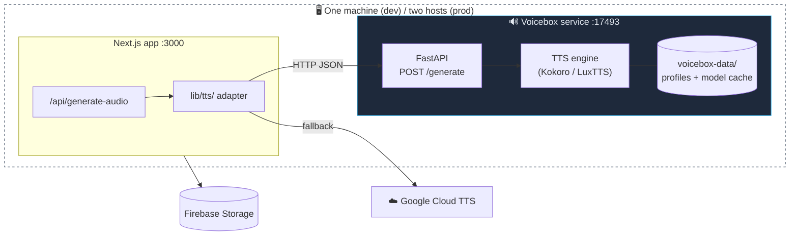
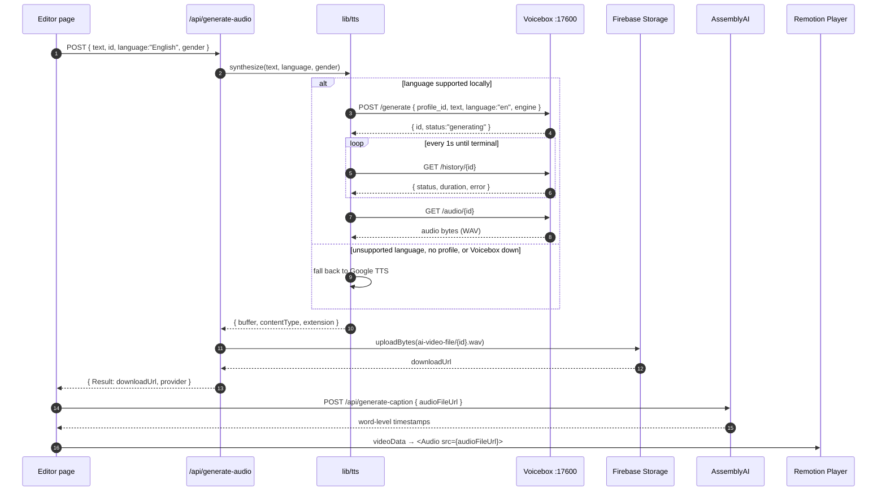
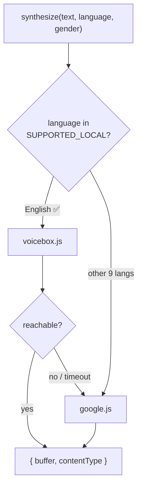
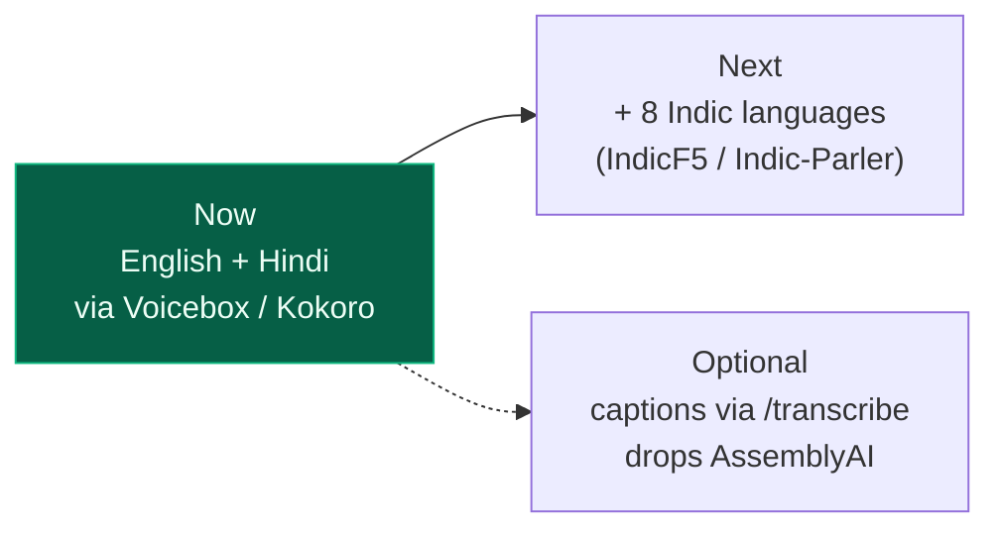

# Voicebox Integration — Local Text-to-Speech

How we replace the paid Google Cloud TTS with a self-hosted
[Voicebox](https://github.com/jamiepine/voicebox) service (MIT, open source), so
voiceovers are generated on our own hardware.

**Scope: English and Hindi only.** These are the two languages Voicebox can
speak of the ten the app used to offer, so both are now free and local. The
other eight are removed from the UI until we add an engine that covers them —
everything is built so that adding them back is a table entry, not a rewrite.

---

## 1. What actually changes

Almost nothing. The voiceover step is one API route, and everything downstream
only cares that it returns **a URL to an audio file**.

| | Before | After (Phase 1) |
| --- | --- | --- |
| Voiceover engine | Google Cloud TTS (paid, per-character) | Voicebox on localhost (free, our GPU) |
| Voice selection | `ssmlGender: MALE / FEMALE` | `profile_id` → a voice profile we create once |
| Audio format | MP3 | WAV (Remotion + AssemblyAI both accept it) |
| Storage | Firebase Storage | Firebase Storage — **unchanged** |
| Captions | AssemblyAI | AssemblyAI — **unchanged in Phase 1** |
| Frontend | `POST /api/generate-audio` | identical — no changes |

The request/response contract of `/api/generate-audio` stays byte-for-byte the
same, which is why `app/dashboard/create-new/editor/page.jsx` needs no edits.

---

## 2. Where Voicebox sits

Voicebox is **not** a library we import. It's a separate long-lived process — a
Python FastAPI server — that we call over HTTP, the same way we call Neon or
Firebase. Think of it as a dependency like Redis, not like a npm package.



Two processes, two lifecycles. We can restart the web app without unloading the
TTS models, and update Voicebox without touching the web app.

---

## 3. The generation flow, end to end

**Generation is asynchronous** — `POST /generate` enqueues a job and returns
immediately with `status: "generating"` and an empty `audio_path`. Getting audio
takes three calls, and `lib/tts/voicebox.js` hides all of it behind one `await`.



Steps 3–8 are the only new hops. Everything from step 11 onward is the existing
pipeline, untouched.

---

## 4. The contract

Verified against `backend/routes/generations.py` and `backend/models.py` in the
upstream repo.

**1 — enqueue:**

```http
POST http://127.0.0.1:17600/generate
Content-Type: application/json

{
  "profile_id": "<uuid>",     // required
  "text": "...",              // 1–50000 chars
  "language": "en",           // must be in the supported set, see below
  "engine": "kokoro",         // qwen (default) | qwen_custom_voice | luxtts |
                              // chatterbox | chatterbox_turbo | tada | kokoro
  "normalize": true
}
```

Returns a `GenerationResponse` **immediately**: `{ id, status: "generating",
audio_path: "", ... }`. No audio yet.

**2 — poll:** `GET /history/{id}` → `{ status, duration, error }`. Status goes
`generating` → `completed` or `failed`. (There's also an SSE stream at
`GET /generate/{id}/status`; we poll instead — simpler, and it survives a dropped
connection.)

**3 — download:** `GET /audio/{id}` → the audio file bytes.

**Supported `language` values** are validated by a regex in `models.py`:
`zh en ja ko de fr ru pt es it he ar da el fi hi ms nl no pl sv tr sw`. Of our
ten languages, only **English and Hindi** are in that set.

**Port:** the upstream `docker-compose.yml` maps host **17600** → container
17493, deliberately, so a desktop install of Voicebox can keep 17493. Our
`VOICEBOX_URL` points at 17600.

**Other endpoints** (not used in Phase 1):

| Endpoint | Purpose |
| --- | --- |
| `GET /health` | liveness check, used by `npm run tts:check` |
| `GET /profiles` | list voice profiles + their ids |
| `GET /profiles/presets/{engine}` | preset voices — no recording needed |
| `POST /transcribe` | Whisper STT — a future replacement for AssemblyAI |
| `POST /speak` | fire-and-forget playback, not useful here |

---

## 5. Code layout

Business logic stays on **our** side. Voicebox stays a dumb "text in, audio out"
box that we never fork, so we can pull upstream updates for free.

```
lib/tts/
  index.js        ← picks a provider for the language, handles fallback
  voicebox.js     ← speaks HTTP to :17493
  google.js       ← the existing Google TTS call, kept as fallback
  profiles.js     ← (language, gender) → profile_id lookup table

app/api/generate-audio/route.jsx
                  ← thin: call lib/tts, upload to Firebase, return the URL
```

The routing table, the gender mapping, and the fallback policy live in
`lib/tts/` — never inside the Python service.



---

## 6. Phase 1 configuration

`.env.local`:

```bash
TTS_PROVIDER=voicebox
VOICEBOX_URL=http://127.0.0.1:17493
VOICEBOX_TIMEOUT_MS=120000        # local TTS is slow; be generous
VB_EN_MALE=<profile id>
VB_EN_FEMALE=<profile id>

# kept for the other nine languages + as a fallback
GOOGLE_TEXT_TO_SPEECH_API_KEY=...
```

`lib/tts/profiles.js`:

```js
export const SUPPORTED_LOCAL = { English: "en", Hindi: "hi" };

export const VOICE_PROFILES = {
  "English:MALE":   process.env.VB_EN_MALE,
  "English:FEMALE": process.env.VB_EN_FEMALE,
  "Hindi:MALE":     process.env.VB_HI_MALE,
  "Hindi:FEMALE":   process.env.VB_HI_FEMALE,
};
```

**Engine: Kokoro** (82M params, tiny, fast). It covers both our languages —
`backend/backends/kokoro_backend.py` ships English presets plus four Hindi ones
(`hf_alpha`, `hf_beta` female; `hm_omega`, `hm_psi` male). One engine for both
languages means no per-language routing, and preset voices mean no recording
session is needed to get profile ids.

The UI language list in
[SelectLanguage.jsx](../app/dashboard/create-new/_components/SelectLanguage.jsx)
is trimmed to match — it must never offer a language `SUPPORTED_LOCAL` and
`GOOGLE_LANGUAGE_CODES` can't both serve.

---

## 7. Setup steps

The app-side code is already in place (`lib/tts/`, the slimmed route, env vars).
What remains is standing up the service:

1. Clone Voicebox **outside** this repo — do not vendor it into the tree:
   `git clone https://github.com/jamiepine/voicebox ../voicebox`
2. `npm run tts:up` — first boot downloads model weights, expect several GB.
3. Open `http://127.0.0.1:17493` and create two English profiles (male, female)
   from the Kokoro presets.
4. `npm run tts:check` — lists the profile ids and synthesizes a test clip.
   Copy the ids into `VB_EN_MALE` / `VB_EN_FEMALE` in `.env.local`.
5. Re-run `npm run tts:check` — it should now write `voicebox-test.wav`. Listen
   to it before going further.
6. Generate an English video end to end; confirm the WAV plays in the Remotion
   preview and that captions still align.
7. Flip `TTS_PROVIDER=google` and re-run to confirm the fallback path is intact.

Until step 4 is done the profile ids are blank, which routes English to Google —
so the app keeps working throughout setup rather than failing half-configured.

Persist `./voicebox-data` as a volume — the profile ids in `.env.local` point at
rows in Voicebox's own storage. Lose the volume and those ids dangle.

---

## 8. Operational notes

- **Speed.** Local neural TTS is slower than the Google API — seconds per
  sentence on CPU, near-realtime on a GPU. The editor already shows a loading
  state, so this degrades gracefully, but it's a real UX difference.
- **Cold start.** The first request after boot loads model weights into memory.
  Keep the service long-lived; don't scale it to zero.
- **Never blocks the app.** If Voicebox is unreachable or times out, the adapter
  falls through to Google. A dead GPU box slows us down, it doesn't break us.
- **Security in prod.** `/generate` has **no authentication**. Do not expose port
  17493 on a public IP. Private network or Tailscale, plus a shared-secret header
  check in front of it.
- **Prod topology.** Voicebox on a GPU host (RunPod / Lambda Labs / our own
  machine); the Next.js side changes by exactly one env var, `VOICEBOX_URL`.

---

## 9. What comes after Phase 1



**Language expansion.** Voicebox validates `language` against a fixed set, and
Tamil, Telugu, Bengali, Gujarati, Kannada, Malayalam, Marathi and Punjabi are
not in it — the API rejects them outright, so this isn't a matter of picking a
different engine. Bringing them back needs a second local service such as
AI4Bharat's IndicF5 or Indic-Parler-TTS. Because the adapter already routes by
language, that arrives as `lib/tts/indic.js`, new rows in `profiles.js`, and the
languages re-added to `SelectLanguage.jsx` — the route and the editor don't
change.

**Captions.** Voicebox's `/transcribe` runs Whisper and could replace
AssemblyAI. One requirement to verify first: our captions need **word-level**
timestamps (`{ text, start, end }`). If `/transcribe` only returns segments, run
`faster-whisper` with `word_timestamps=True` and map its output to the same
shape.

---

## Related docs

- [ARCHITECTURE.md](./ARCHITECTURE.md) — the overall system
- [REMOTION_GUIDE.md](./REMOTION_GUIDE.md) — how the audio URL becomes video
